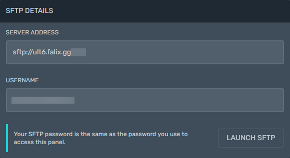

<!-- RCON is being added later -->
<!-- In Progress
{: .label .label-yellow } -->

<video controls poster="https://i.imgur.com/p9rgs15.png" src="https://files.catbox.moe/vavkhu.mp4"></video>

## SFTP
### What is SFTP
In computing, the SSH File Transfer Protocol is a network protocol that provides file access, file transfer, and file management over any reliable data stream. It was designed by the Internet Engineering Task Force as an extension of the Secure Shell protocol version 2.0 to provide secure file transfer capabilities. [Wikipedia](https://en.wikipedia.org/wiki/SSH_File_Transfer_Protocol){:target='_blank'}

This allows you to manage files remotely through an SFTP client without having to access our game panel.

### Choosing a SFTP Client
A SFTP client is required:

SFTP Clients:

| Software | Platform Support                               |
|:---------|:---------------------|:-------------------------|
| [Filezilla](https://filezilla-project.org/download.php?type=client) | Windows, macOS, and Linux |
| [Cyberduck](https://cyberduck.io/download/) | Windows and macOS |
| [WinSCP](https://winscp.net/eng/download.php) | Windows |
| [Swish](https://sourceforge.net/projects/swish/) | Windows |
| [AndFTP](https://play.google.com/store/apps/details?id=lysesoft.andftp&hl=en_US&gl=US) | Android |
| [FTPManager](https://apps.apple.com/us/app/ftpmanager-ftp-sftp-client/id525959186) | IOS |

NOTE: Linux usually has SFTP integration built into the file manager.

## Connecting to your server

### Method 1

1. Go to the [panel](https://panel.falixnodes.net).
2. Click on your server then go to the "Settings" tab.
3. Make sure you have an SFTP client installed.
4. Click on "Launch SFTP".
5. You should see your SFTP client launch, if this does not happen follow [Method 2](https://help.falixnodes.net/falix/general/sftp/#method-2).
6. Type in your panel's password (the password you used to log in to the panel).

### Method 2

1. Go to the [panel](https://panel.falixnodes.net).
2. Click on your server then go to the "Settings" tab.
3. Launch your SFTP client.
4. Follow the table below.

|SFTP details   | Description                                                                         |
|---------------|-------------------------------------------------------------------------------------|
|SERVER ADDRESS | The text before the colons (:) is your Hostname. The numbers after the colons (:) is your port. |
|---------------|-------------------------------------------------------------------------------------|
|USERNAME       | Insert this into the "username" field.                                              |
|---------------|-------------------------------------------------------------------------------------|
|Password       | Insert your panel's password into the "password" field.                             |

