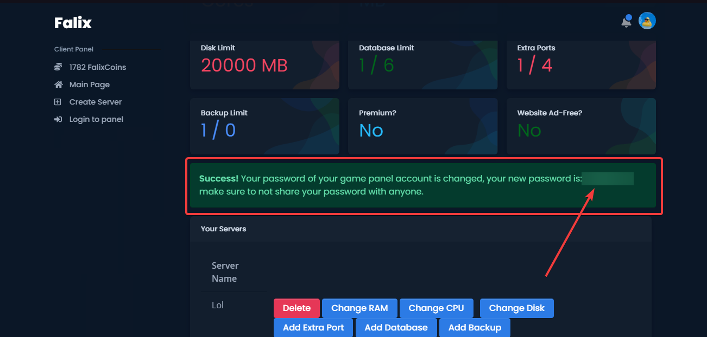

# Your Account
## Identifying
On Falix, we identify accounts using their Discord ID, this is used to search for users on our staff admin panel.

To get your Discord ID on Discord, please enable developer mode in your appearance settings. Head over to the account settings, click on the 3 dots button on the right side and click Copy ID.

## Transferring
It is currently not possible to transfer your Falix server and account to another Discord account. We also don't allow multiple accounts, so using another Discord account on our platform will be detected as an alt account. You should stay with your current Discord account and continue to use it to log in to our service.

# Managing
## Resetting Your Password
If you've forgotten your account's password for the Game Panel, click on your profile picture in the top right corner of your screen on the [Client Page](client.falixnodes.net/), then click on "[Settings](https://client.falixnodes.net/profile/settings)". You should be redirected to another page. 
Scroll down and click on "Change Game Panel Password". You will be redirected back to the main page, scroll down and you should see a success alert containing your password.

## Deleting Account
To delete your account, go to our Client Panel > click on your profile > click settings. Click Delete Account, just to make sure you'll need to confirm a few times.
