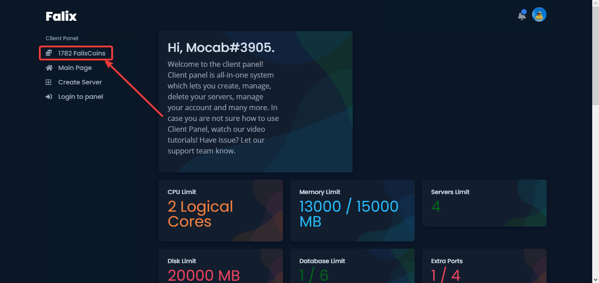
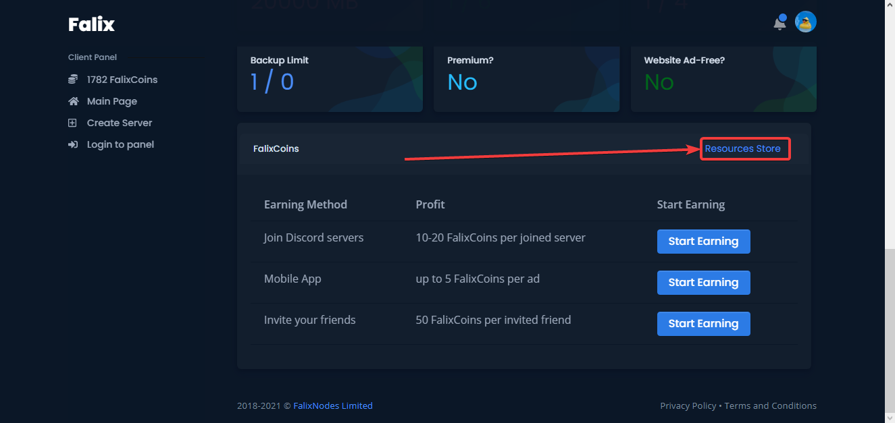

## Store
We have a store in which you can buy resources like RAM, CPU cores, disks, etc using Falixcoins.

## How to access the store
1. Login into the [client panel](https://client.falixnodes.net).
2. Click on "[... FalixCoins](https://client.falixnodes.net/coins)" at the top left of the page.

3. Click on "[Resources Store](https://client.falixnodes.net/store)" at the right side of the page.

## How to use the store
After getting redirected to the store website, you will see the price of the item and an interface to change the number of units of the item you would like to buy. After selecting the right unit of the item, click to buy. You should see coins deducted and the item you purchased increase.