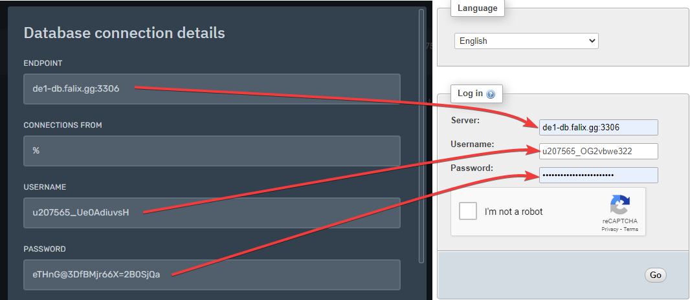

# Guide On How To Use Databases
## What Are Databases?
Databases are an organized collection of information. In Falix we support MariaDB databases.

## What Are Databases Useful For? 
They are needed by some plugins/bots to store data. If you are using a plugin, it usually states whether it needs a database or not in its wiki page.

# Getting Started
## Step 1: Allocating A Database To Your Server

1. Go to the [Client Panel](https://client.falixnodes.net).
2. Scroll down and click on "Add Database".
3. The page will reload, you should see a success message above the list of your servers.

## Step 2: Creating The Database

1. Go to the [Game Panel](https://panel.falixnodes.net).
2. Click on your server.
3. Click on "Databases".
4. Click on "New Database", it should be a big blue button at the bottom right of the page.

5. You should see a popup appear, enter in any name you like in the "Database Name" field.
6. For the second field you can enter in the node's IP, or leave it as `%`.
7. Once you have filled in the fields, click on "Create Database".

8. Your database should be created, click on the eye icon to view your database credentials.

## Step 3: Viewing And Editing The Contents Of Your Database

### What is Phpmyadmin?
Phpmyadmin is a free tool used to access and edit databases.

1. Copy all your database credentials, this is needed to access the database.
2. Go to [Phpmyadmin](https://phpmyadmin.co/).
3. Insert your database credentials into the fields provided, follow the table below.

| Database credentials                      |           =       | Login credentials                                     |
|-------------------------------------------|-------------------|-------------------------------------------------------|
| Endpoint                                  |           =       | Server                                                |
|-------------------------------------------|-------------------|-------------------------------------------------------|
| Username                                  |           =       | Username                                              |
|-------------------------------------------|-------------------|-------------------------------------------------------|
| Password                                  |           =       | Password                                              |

It should look like this:

4. Click on "Go".
5. You should be logged in.

> Remember to put `%` in the "Connections from" field in the database's settings before attempting to access it.

