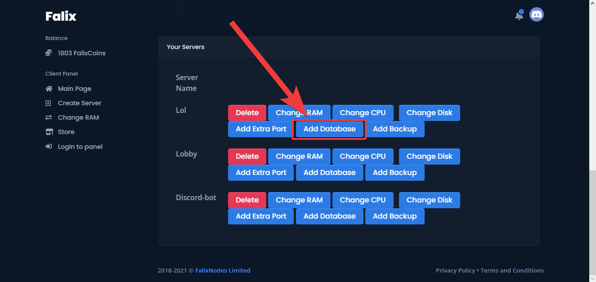
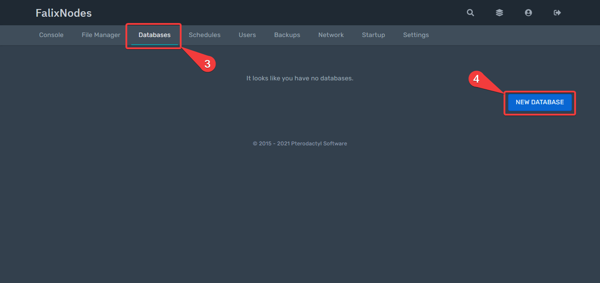
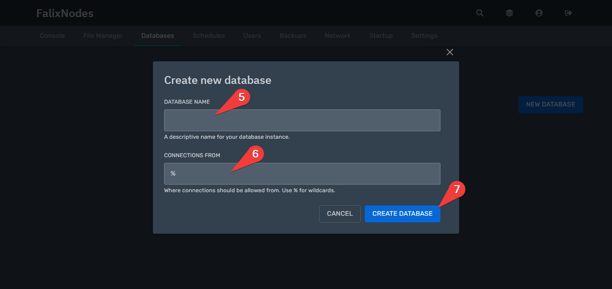

# Guide On How To Use Databases
## What Are Databases?
Databases are an organized collection of information. 
The database our panel supports is [MariaDB](https://mariadb.org).
MariaDB is a very popular open source database which was developed by the original MySQL developers.

## What Are Databases Useful For? 
Some server plugins, bots, or systems may require a database to store information. Minecraft plugins will usually state whether they need/support an SQL database.

# Getting Started
## Step 1: Allocating A Database To Your Server

1. Go to the [Client Panel](https://client.falixnodes.net).
2. Scroll down and click on "Add Database".
3. The page will reload, you should see a success message above the list of your servers.

## Step 2: Creating The Database

1. Go to the [Game Panel](https://panel.falixnodes.net).
2. Click on your server.
3. Click on "Databases".
4. Click on "New Database", it should be a big blue button at the bottom right of the page.

5. You should see a popup appear, enter in any name you like in the "Database Name" field.
6. For the second field you can enter in the node's IP, or leave it as `%`.
7. Once you have filled in the fields, click on "Create Database".

8. Your database should be created, click on the eye icon to view your database credentials.

## Step 3: Viewing And Editing The Contents Of Your Database

The database we support is [MariaDB](https://mariadb.org). 
To connect, simply use the credentials given.

If you'd like to view or edit information inside of the database from a website, you may use [phpMyAdmin](https://phpmyadmin.co).

