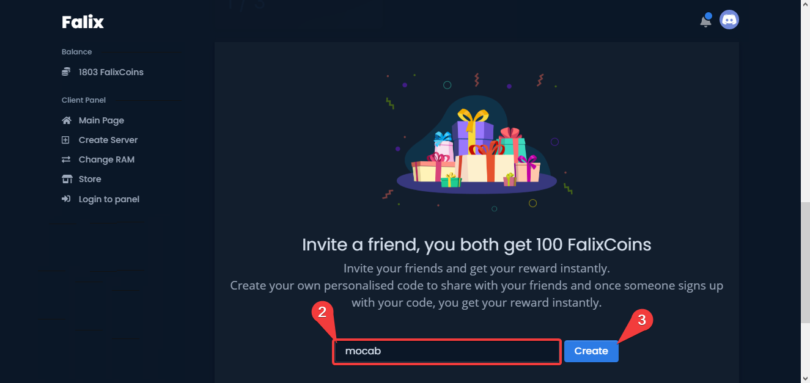
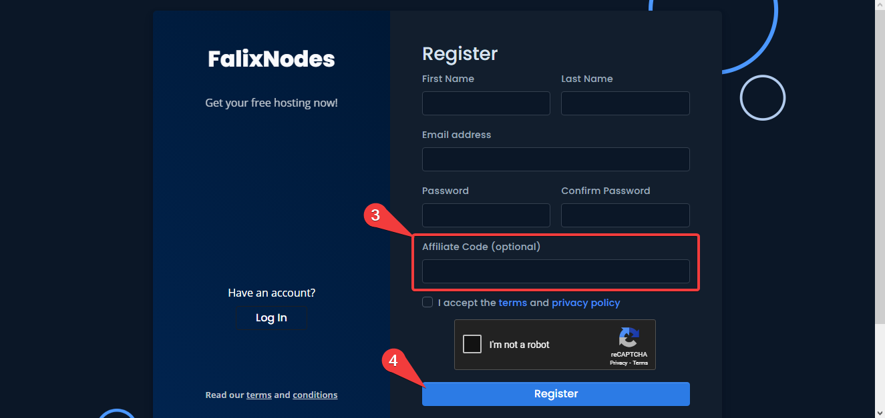

There are currently two ways of getting coins, you can find them [here](https://client.falixnodes.net/coins).

# Watching Advertisements
You can watch advertisements on our Android app to earn coins, follow the steps below to learn how:

1. Make sure that your Falix account is linked with your discord account, you can do so [here](https://client.falixnodes.net/profile/settings).
2. Download the app from the [Play Store](https://play.google.com/store/apps/details?id=net.falixnodes.falixcoins).
3. Copy your Discord user ID, follow [this](https://support.discord.com/hc/en-us/articles/206346498) guide to learn how.
4. Open the app and insert your discord user ID into the given field.
5. Click on "Watch ads".

> Note: any kinds of scripts, macros, and auto clickers are strictly not allowed.

If you do not see any ads, try again later.

# Referring
You can refer your friends to register through your affiliate code for 50 coins per user, follow the steps below to learn how:

## Creating your affiliate code

1. Go to your [affiliate page](https://client.falixnodes.net/affiliate/link).
2. Scroll down then enter in any code you wish, this will be your affiliate code.
3. Click on "Create".
4. Your page should reload with a success message.

## How to use an affiliate code

1. Go to the [login page](https://client.falixnodes.net/auth/register).
2. Fill in your details.
3. Enter in an affiliate code.
4. Click on register.

> Note: Alting is **strictly prohibited**.