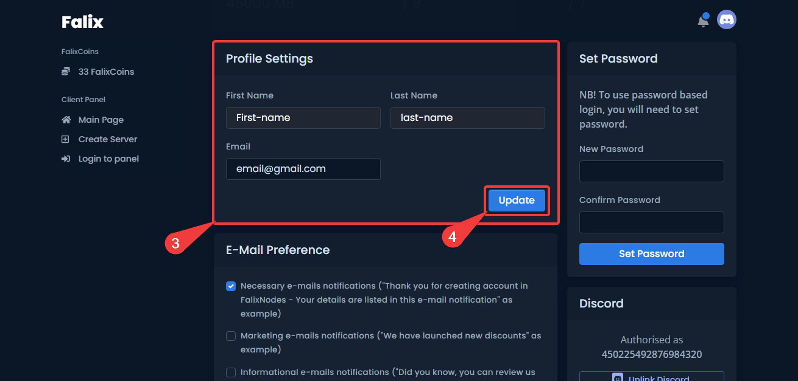
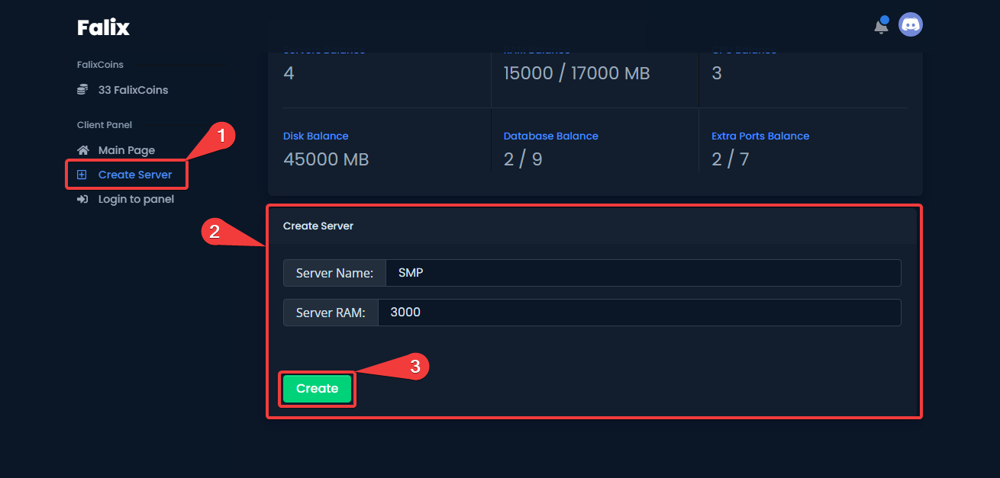
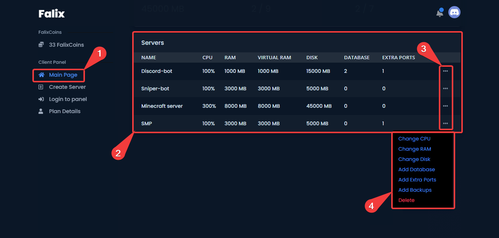

# Getting Started

Welcome to FalixNodes! Here you can host game servers for free! To get started, sign up at our [Client Panel](https://client.falixnodes.net/auth/register), which allows you to create & manage your servers!

## Signing Up
There are two ways to sign up. You can either use your email and a password, or your Discord account.

### Registering With A Username And Password

1. Go to the [Register page](https://client.falixnodes.net/auth/register).
2. Fill in all the fields.
3. Click on "Register".

### Registering With Discord

1. Go to the [Register page](https://client.falixnodes.net/auth/register).
2. Scroll down and click on "Discord". You will shortly be redirected to the Discord domain.
3. Scroll down once more and click on "Authorize".

### Updating Your Account Credentials

1. Click on the account avatar at the top right of the page.
2. Click on "Settings".
3. Fill in all the fields under "Profile Settings".
4. Click on "Update".

## Creating A Server

1. Click on "Create Server". It should be in the navbar on the left.
2. Scroll down and fill in all the fields given.
3. Click on "Create!".

## Logging Into The Game Panel

1. Go to the [Settings Page](https://client.falixnodes.net/profile/settings).
2. Make sure you have updated your details under the "Profile Settings" category.
3. Scroll down and click on "Change Password" under the "Danger" category.
4. Click on "Login To Panel". You should be able to see your login credentials.
5. To log in, go to the [Game Panel](https://panel.falixnodes.net) and fill in all your login credentials.

<video controls preload="auto"><source
 src="../../../assets/videos/getting-started/reset-panel-password.webm" type="video/webm"
 /></video>

## Upgrading Your Server

Here in Falix, you can upgrade your server by earning coins then purchasing resources from the store. Follow the steps below:

### Getting Coins

A guide to this can be found [here](https://help.falixnodes.net/falix/general/getting-coins/).

### Buying Items From The Store

A guide to this can be found [here](https://help.falixnodes.net/falix/general/buying-items-from-the-store/).

### Managing Your Server Allocations

1. Go to the [Client Panel](https://client.falixnodes.net).
2. Scroll down. You should see a list of your servers.
3. Click on the three buttons to its right, you should see a popup appear.
4. You can manage your server allocations here. You can also delete your server.

