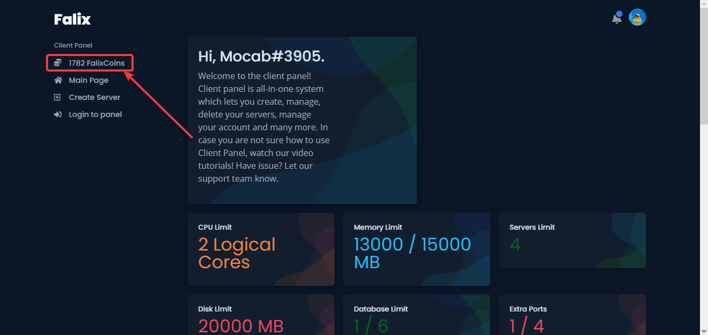
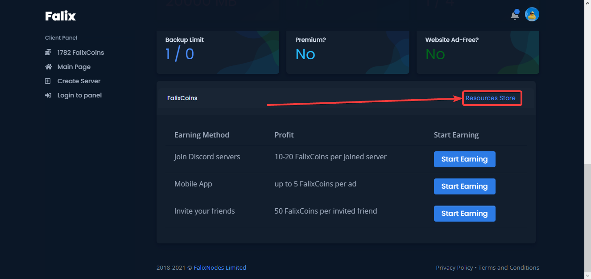

## Store
We have a store in which you can purchase plans, which gives you resources that can be used to upgrade your server.

## How To Access The Store
1. Login into the [Client Panel](https://client.falixnodes.net).
2. Click on "[... FalixCoins](https://client.falixnodes.net/coins)" at the top left of the page.

3. Click on "[Resources Store](https://client.falixnodes.net/store)" at the right side of the page.

## How To Use The Store
After getting redirected to the store page, you will see the price of the plans and a purchase button. After selecting a plan, click on "Purchase Now". You should see coins deducted and your plan should be updated.

> Plans are not a one time purchase, you will have to pay every month.