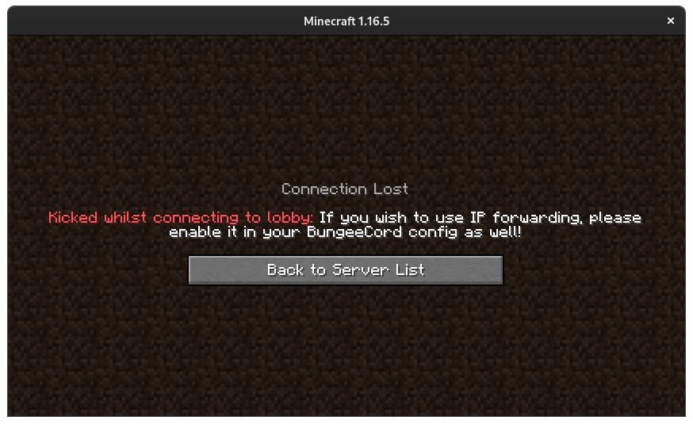
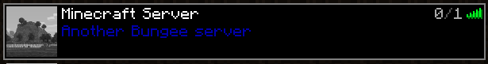

# Getting Started with BungeeCord
## What and Why?
### What is it?
[BungeeCord](https://www.spigotmc.org/wiki/bungeecord/), created by the [SpigotMC](https://www.spigotmc.org/XenStaff/) team, is a proxy designed to seamlessly bridge the connection from one Minecraft server to another, allowing the player to navigate between them without leaving the game.
### Why?
This is very beneficial for server administrators that want to separate their server's activities (such as minigames, creative, survival, and so on). BungeeCord is utilized and trusted by notable servers like as [Hypixel](https://hypixel.net/), [Mineplex](https://www.mineplex.com/home/), [HiveMC](https://hivemc.com/), and much more.

## Preparing Your Servers
### Configuration
BungeeCord is compatible with Spigot, Purper, PaperMC, and any Spigot fork. It will **NOT** function on Forge/Fabric or vanilla servers.

In your Spigot server, you'll need to configure both the <u>spigot.yml</u> and <u>server.properties</u> file.

In <u>spigot.yml</u>, set `bungeecord:` to `true` under `settings:`.

In <u>server.properties</u>, set `online-mode` to `false`. Now, I know what're you thinking, wouldn't that make my server a crack server? No, it won't, if you want a crack BungeeCord server you'll need to also set the online mode in your BungeeCord configuration.

The reason why your Spigot servers need to have online mode off is explained well from VoidCraftedGaming on Reddit:

*"Essentially, when a server is in online mode, the connection between the server and client is encrypted. Additionally, you get a session key/code when you press the join button on the home screen, which can be essentially "redeemed" for one online mode login.*

*Now let's say we have a proxy between the client and the server - firstly the connection between the client and the server is encrypted so the proxy can't listen in to, for example, process commands, and secondly the proxy can't switch you between servers because your session key is only valid for that one connection.*

*Bungeecord therefore requires offline mode to get around this restriction. However, this shouldn't cause issues with plugins if you have IP forwarding enabled. What IP forwarding does is, Bungeecord authenticates the user with mojang then adds a special packet to the login protocol that says "I'm Bungeecord, trust me, I've authenticated this user as UUID xxxx", where xxxx is an online mode, mojang issued UUID.
*
*This means that the spigot server then trusts that this is the player's UUID, and as far as the plugins are concerned the server is in online mode and the players have valid UUIDs. All you need to do to make this work is enable ip-forward in Bungeecord's config and enable bungeecord: true in spigot.yml"*

## Creating the Proxy
### Create and Setup
To create a Minecraft Java server, go to your Client Panel. On the left sidebar, choose Create Server. Type in all required information like server name, memory amount, and server location. Once done, click the Create button and wait at least a minute in the Client Panel for the new server to be created for your account.

Now, in the [Game Panel](https://panel.falixnodes.net/) you should see the new server on your server list. If the server list indicates that it is still installing, wait at least 2 to 5 minutes for the installation to be complete. If the installation is taking longer than usual (over 5 to 10 minutes or more), head back to your [Client Panel](https://client.falixnodes.net/) and delete, then re-create the server.

Select your new server and go to the Console tab, usually already selected by default. Click the Start button, located in the upper left corner of the Console tab. You're going to be selecting which type of server you want during the first startup of your new server. In this case, we're creating a **BungeeCord** server, so when the console asks what type of server you want, select `17` and press enter. The server will be marked offline for a few seconds then will reboot.

> NOTE: There is currently a bug where the error `Invalid or corrupt jarfile bungeecord.jar` will show up when trying to boot your BungeeCord proxy, this can be fixed by following the instructions in the [Troubleshooting](https://help.falixnodes.net/falix/general/troubleshooting/#corrupted-bungeecord-jar-file) article. We apologize for the inconvenience you may have and we're well aware of the situation.

### Configurations
You can view all other configuration options on the [BungeeCord Guide](https://www.spigotmc.org/wiki/bungeecord-configuration-guide/).

#### Port
After reading the note above, the BungeeCord proxy should be up and running now, however, it is still in the process of being configured. We need to fix the port number that BungeeCord is set to, by default BungeeCord uses port `25577`. In Falix, we provide a different port for your server, so you'll need to set this in the <u>config.yml</u> file. Change `25577` where it says `host:`.

Example, default configuration:
```
host: 0.0.0.0:25577
```

Just change the port number only, we recommend that you leave `0.0.0.0` as it is.

#### IP Forwarding
With BungeeCord #711 and higher, IP forwarding must be manually enabled on both the proxy and Spigot to ensure that your users' IP address shows the true value and that your spigot servers get online-mode UUIDs.
Without enabling IP forwarding, the proxy IP will be displayed for all players, possibly causing problems when it comes to IP bans and the UUIDs of your players will be in offline mode which will result in issues when a player changes his or her name.

Set `ip_forward:` to `true` or you will get the following error message when connecting:



#### Message of the Day
When users add your server to their multiplayer list, the message of the day will be shown directly from the BungeeCord proxy and not from any other server. The `motd` configuration you should change is under `listeners:`.

Example, default configuration:
```
motd: '&1Another Bungee server'
```



#### Player Limit
You'll noticed that the player limit is set to 1 by default, you can change this to whatever you want like `2000` or `20000`. You can also set it to unlimited by setting it to `-1`

## Commands
### BungeeCord
Admin only commands are listed below:

| Commands | Description 
|:---------|:------------
| `alert <message>` | Issues an alert to all users connected to BungeeCord. This is useful for announcements that need to be shown across every server. Color codes may be used with &. The special code &h will hide all default formatting, allowing for completely custom messages. To use HEX colors, follow the Spigot style. For example, if the HEX color was `#123456`, you'd do: `&x&1&2&3&4&5&6` |
| `alertraw <json>` | DeIssues an alert to all users connected to BungeeCord, but allows the use of Minecraft **JSON** formatting. |
| `end` | **Shuts down** the BungeeCord instance, and disconnects any users connected. Equivalent to /stop on your Spigot servers, except stops bungee. |
| `find <player>` | Confirms whether a player with the username provided is online and determines which server the player is connected to. |
| `greload` | Reload configuration, similar to `reload` in Bukkit/Spigot. |
| `ip <player>` | Shows the real IP address of a player connected to BungeeCord. This command exists since using an IP command with a Bukkit plugin, such as Essentials, could possibly return as localhost due to the way BungeeCord works. |
| `perms` | Shows all permissions you have, and all groups which you are in. |
| `send <player/current/all> <target>` | Sends the specified player(s) to the specified server. Passing "all" will send all players who are on the proxy but not on the target server. Passing a player name will send the specified player, and "current" will send all players on your server. |

### In Game
Players, including you (of course), can easily teleport to the other servers on your network by using the `/server` command in-game. Then they can use their cursor to click on the server they want to go to. They can also do `/server <name>`, like `/server lobby`.

In-Game example:

<video class="video-js" controls preload="auto" data-setup="{}"><source
 src="https://media.korbsstudio.com/falix/bungeecord/in-game-command-server.webm" type="video/webm"
 src="https://media.korbsstudio.com/falix/bungeecord/in-game-command-server.mp4" type="video/mp4"
 /></video>