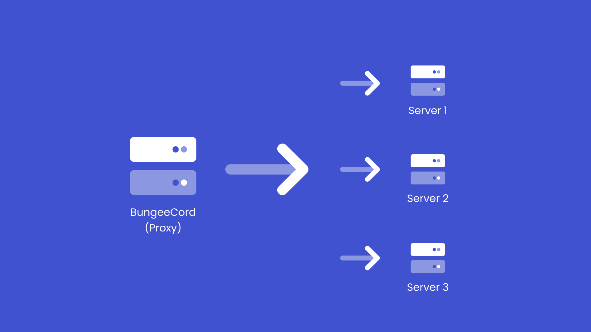
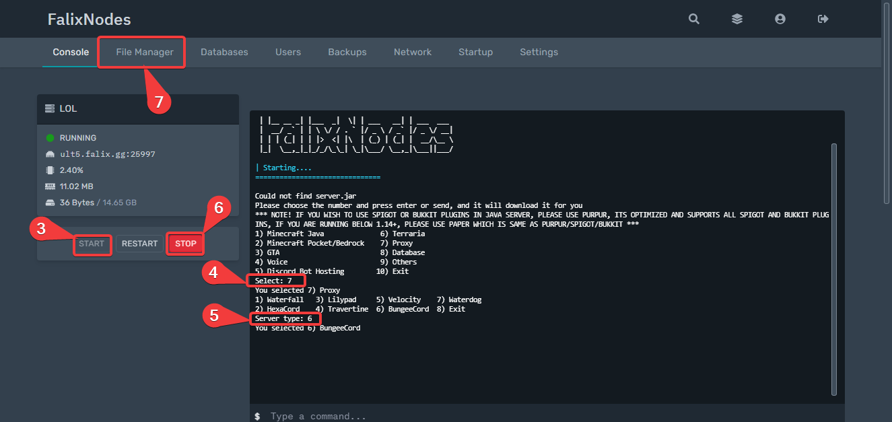
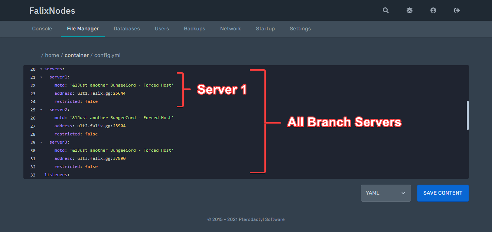

# Getting Started With BungeeCord

### What Is It?
[BungeeCord](https://www.spigotmc.org/wiki/bungeecord/), created by the [SpigotMC](https://www.spigotmc.org/XenStaff/) team, is a proxy designed to seamlessly bridge the connection from one Minecraft server to another, allowing the player to navigate between them without leaving the game. BungeeCord is compatible with Spigot, Purpur, PaperMC, and any Spigot fork. It will **NOT** function on Forge/Fabric or vanilla servers.
### What is it useful for?
It is very beneficial for server administrators that want to separate their server's activities (such as minigames, creative, survival, and so on). BungeeCord is utilized and trusted by notable servers such as [Hypixel](https://hypixel.net/), [Mineplex](https://www.mineplex.com/home/), [HiveMC](https://hivemc.com/), and much more.

## Preparing The Branch Servers
#### What Are Branch Servers?
Branch servers are all servers connected to your Bungeecord server.

1. Go to the [Game Panel](https://panel.falixnodes.net).
2. Click on any of your branch servers.
3. Setup your server if it has not been setup before.
4. Go to the file manager.
5. Locate and open `server.properties`.
6. Scroll down and set `online-mode` to `false`.
7. Return to the file manager.
8. Locate and open `spigot.yml`.
9. Set `bungeecord` to `true`.
10. Restart the server.

Repeat the steps above for all your branch servers.

## Creating And Configuring The Proxy 

1. Go to the [Game Panel](https://panel.falixnodes.net).
2. Click on any server you want.
3. Start the server.
4. Type `7` and click on enter.
5. Type `6` and click on enter.
Wait for half a minute, your server should be on.
> Note: Do not rely on the server status at the top left of the page, it does not indicate the status of proxy servers properly.
6. Click on "Stop" then click on "Kill".
7. Click on "File Manager" at the top of the page.

8. Locate `config.yml` and open it.
9. Scroll down to `host: 0.0.0.0:25577` and change the numbers after `:` to your bungeecord's port. You can find your port in the "Network" tab at the top of the page.
10. Scroll down to `priorities:- lobby`, change `lobby` to your Hub/Lobby name (Case sensitive).
11. Scroll down and set `IP_forward` to `true`.
12. Scroll down to `servers:` follow the format below:

```
  server-name:
    motd: '&1Just another BungeeCord - Forced Host'
    address: server-IP:PORT
    restricted: false
```
Change `server-name` to the branch server's name (case sensitive).
Change `server-IP:PORT`  to the branch server's IP and PORT.

> If you have multiple branch servers, duplicate the code above and paste it under your first server.

It should look like this:


13. Save your file and start your server.

> You can view all other configuration options [here](https://www.spigotmc.org/wiki/bungeecord-configuration-guide/).

## Bungeecord Commands
Admin only commands are listed below:

| Commands | Description 
|:---------|:------------
| `alert <message>` | Issues an alert to all users connected to BungeeCord. This is useful for announcements that need to be shown across every server. Color codes may be used with &. The special code &h will hide all default formatting, allowing for completely custom messages. To use HEX colors, follow the Spigot style. For example, if the HEX color was `#123456`, you'd do: `&x&1&2&3&4&5&6` |
| `alertraw <json>` | DeIssues an alert to all users connected to BungeeCord, but allows the use of Minecraft **JSON** formatting. |
| `end` | **Shuts down** the BungeeCord instance, and disconnects any users connected. Equivalent to /stop on your Spigot servers, except stops bungee. |
| `find <player>` | Confirms whether a player with the username provided is online and determines which server the player is connected to. |
| `greload` | Reload configuration, similar to `reload` in Bukkit/Spigot. |
| `ip <player>` | Shows the real IP address of a player connected to BungeeCord. This command exists since using an IP command with a Bukkit plugin, such as Essentials, could possibly return as localhost due to the way BungeeCord works. |
| `perms` | Shows all permissions you have, and all groups which you are in. |
| `send <player/current/all> <target>` | Sends the specified player(s) to the specified server. Passing "all" will send all players who are on the proxy but not on the target server. Passing a player name will send the specified player, and "current" will send all players on your server. |

### In Game
Players, including you (of course), can easily teleport to the other servers on your network by using the `/server` command in-game. Then they can use their cursor to click on the server they want to go to. They can also do `/server <name>`, like `/server lobby`.

In-Game example:

<video class="video-js" controls preload="auto" data-setup="{}"><source
 src="https://media.korbsstudio.com/falix/bungeecord/in-game-command-server.webm" type="video/webm"
 src="https://media.korbsstudio.com/falix/bungeecord/in-game-command-server.mp4" type="video/mp4"
 /></video>