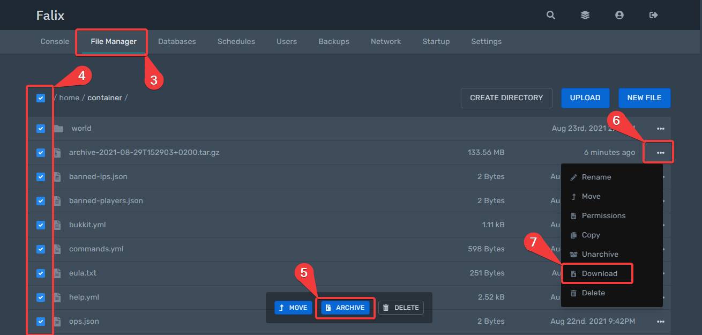

# Creating local backups of your server

1. Head over to the [panel](https://panel.falixnodes.net).
2. Click on the server you want to backup.
3. Go to the file manager
4. Select the files you want to backup, click on the highest box to select all the files.
5. Click on "archive" at the bottom of the page.
6. An archive should be created, find it and click on the 3 dots to its right.
7. Click on "download".
8. un-archive the files on your device.

Note: you can also use [SFTP](https://help.falixnodes.net/falix/general/sftp/) to download your files.

