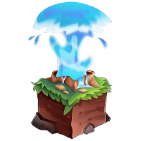
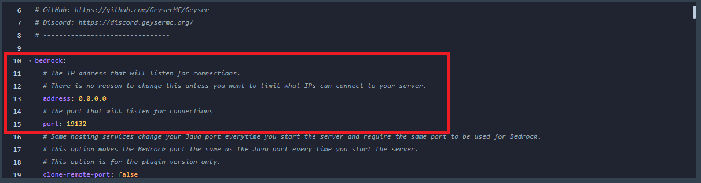
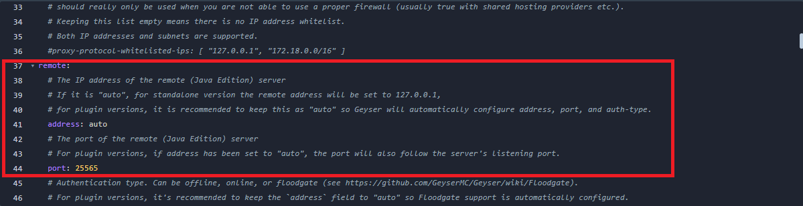

    
    
GeyserMC

    <a href="https://ci.opencollab.dev//job/GeyserMC/job/Geyser/job/master/lastSuccessfulBuild/artifact/bootstrap/spigot/target/Geyser-Spigot.jar">Download this Plugin</a>

# How to make a cross-platform server

## What is GeyserMC?
Geyser is a proxy that allows Minecraft bedrock clients to join Minecraft Java servers.

## How does it work?
Geyser translates all the incoming and outgoing packets between the client and the server.

## Prerequisites

- Make sure your server has the latest Minecraft Java Edition version (currently 1.17.1).
- Your bedrock client has to be a supported version (currently 1.17 / 1.17.1 / 1.17.2 )

# Setting up GeyserMC

1. Set up the server, you can use spigot or any of its forks, we recommend using Purpur or Paper.
2. Open the file manager.
3. Find and open a folder called "plugins".
4. Upload the plugin you downloaded, you can find the download link at the top of this page.
5. Restart the server.
6. Go back to the "plugins" folder, you should see that a new folder was generated, it is usually named "Geyser-Spigot".
7. Open the folder and click on "config.yml".
8. Follow the table below and change as needed.

## Bedrock:

|Variable               |Description                                                        |
|-----------------------|-------------------------------------------------------------------|
|address:               |Leave it as 0.0.0.0                                                |
|-----------------------|-------------------------------------------------------------------|
|port:                  |Replace this with your server's port, you can get your port from the "networks" tab in the game panel. |

## Remote:

|Variable               |Description                                                        |
|-----------------------|-------------------------------------------------------------------|
|address:               |Leave this as "auto"                                               |
|-----------------------|-------------------------------------------------------------------|
|port:                  |Replace this with your server's port, you can get your port from the "networks" tab in the game panel. |
|-----------------------|-------------------------------------------------------------------|
|auth-type:             |Authentication type. Can be offline, online, or [floodgate](https://github.com/GeyserMC/Geyser/wiki/Floodgate), choose "offline" if you want cracked accounts to join your server.

9. Click on "Save" once you are done.
10. Restart the server.
11. Done! You have successfully set up GeyserMC!

#### We recommend that you go through the config files and make any extra changes according to your needs.
