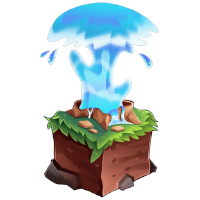
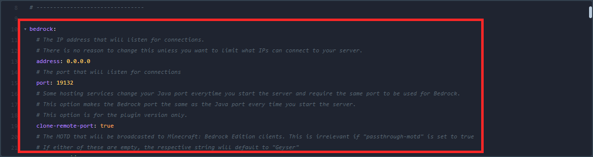

    
    <h2>GeyserMC</h2>
    <h3>Team</h3> 
    <a href="https://ci.opencollab.dev//job/GeyserMC/job/Geyser/job/master/lastSuccessfulBuild/artifact/bootstrap/spigot/target/Geyser-Spigot.jar">Download this Plugin</a>

# What is GeyserMC?
Using this plugin will allow Minecraft Bedrock clients to join Minecraft Java servers.

## How does it work?
Geyser translates all the incoming and outgoing packets between the client and the server.

## Prerequisites

- Make sure your server has the latest Minecraft Java Edition version (currently 1.17.1).
- Your Minecraft Bedrock client has to be a supported version (currently 1.17+).

# Setting up GeyserMC

Create a server and install Spigot or any of its forks, we recommend using [Purpur](https://purpur.pl3x.net) or [Paper](https://papermc.io). After its installation is complete, open your server's file manager, find and open the folder named "plugins", upload the downloaded .jar file and restart your server. Once done, go back to the plugins folder and you should see that a new folder was generated, usually named "Geyser-Spigot". Open the folder and open the file "config.yml". Afterward, follow the tables below and change as needed.

## Bedrock:

|Variable               |Description                                                        |
|-----------------------|-------------------------------------------------------------------|
|address:               |Leave it as 0.0.0.0                                                |
|-----------------------|-------------------------------------------------------------------|
|port:                  |Replace this with your server's port, you can get your port from the "networks" tab in the game panel. |

## Remote:

|Variable               |Description                                                        |
|-----------------------|-------------------------------------------------------------------|
|address:               |Leave this as "auto"                                               |
|-----------------------|-------------------------------------------------------------------|
|port:                  |Replace this with your server's port, you can get your port from the "networks" tab in the game panel. |
|-----------------------|-------------------------------------------------------------------|
|auth-type:             |Authentication type. Can be offline, online, or [floodgate](https://github.com/GeyserMC/Geyser/wiki/Floodgate), choose "offline" if you want cracked accounts to join your server.

Once you're done configuring your server, save the file and restart your server.

> We recommend that you go through the configuration files and make any extra changes according to your needs.
